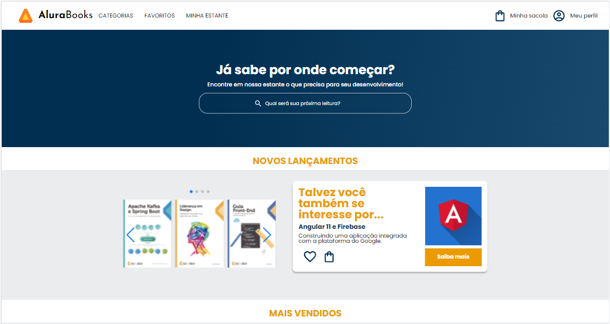
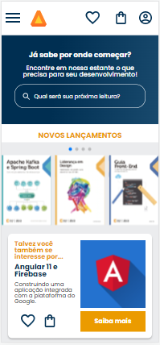

# Projeto AluraBooks

Projeto de um site de compras de livros desenvolvido no curso de responsividade da Alura. 

O projeto foi construído utilizando a técnica mobile first e com padrão de nomenclatura de classes BEM.
 

## 💻 Layout  

Toda a estilização usada no projeto pode ser encontrada no figma
[(Link do projeto).](https://www.figma.com/file/KlYQWcCOIeaqFavgblqC83/AluraBooks-(Copy)?node-id=37%3A94)

### Web

  

### Mobile

  

 ## 🔧 Tecnologias 

As tecnologias usadas foram: 
* HTML
* CSS
